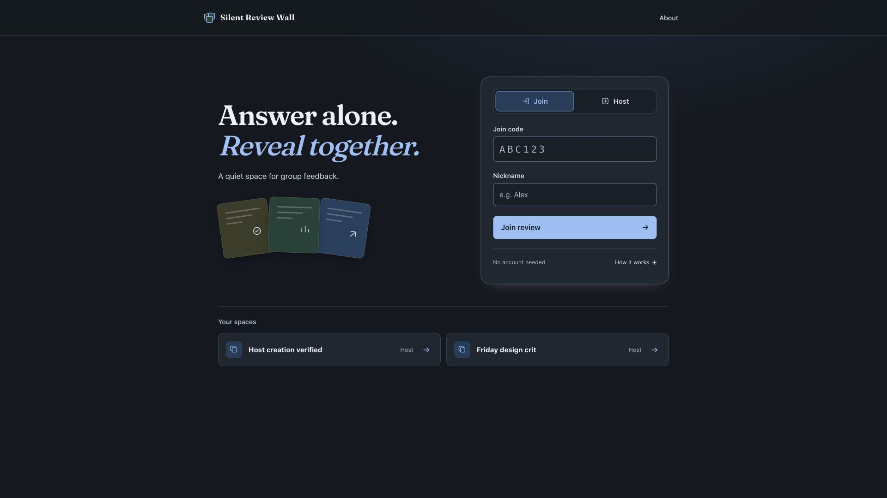

# Silent Review Wall

A quiet first round for group feedback. A host opens a review space and shares a
join code. Everyone answers one question on their own, without seeing anyone
else's answer. At the deadline the wall reveals every response at once, and the
group decides together what is worth talking about.



## Who it is for

A small group in one room or one call: a tutorial, a studio crit, a team
retro. Ten to twenty people, one afternoon, not an audience of hundreds.

## What good means here

In an open discussion the first confident voice often sets the direction, and
quieter people adjust to match it. Silent Review Wall is good if everyone forms
their own view before they can see anyone else's. That means:

1. **Nobody sees another answer before the reveal**, the host included, and not
   in the data sent to the browser either.
2. **The deadline is the same for everyone and cannot be stretched.** The
   server's clock decides, and the reveal happens even when the host has left.
3. **"Saved" means saved.** Unsaved text is never lost or passed off as
   submitted.
4. **Everyone knows which phase they are in** and what they can do now.
5. **The results can be checked.** Percentages and keyword frequencies show
   the counts behind them.
6. **It survives real conditions:** late joiners, dropped connections and
   server restarts.

## What is enforced and what is judged

Points 1, 2, 3 and 5 are enforced by tests in `spec/`: privacy before the
reveal, the deadline boundary, one response per person, conflicting edits, vote
and keyword counts, and likes. Point 6 is only partly tested. The rule that an
expired question recovers as revealed is tested, but persistence across a real
restart and redeploy on Fly has not been checked yet.

Point 4, and whether the wall actually improves discussion, can only be judged.
So far I have checked them myself at 1920×1080 and 390×844 with two identities.
That is a developer check, not evidence. Next, classmates will run a review
without my help while I note where they get stuck.

## What I chose not to build

- **Accounts.** A browser cookie is the identity, so joining takes one code.
  Switching browsers makes a new person, and the app says so.
- **Several live questions at once**, which would blur the phase.
- **Early reveal or reopening**, which would break the fixed deadline.
- **Author names on results.** Cards are anonymous to participants, though the
  server still knows who wrote what.
- **Chat.** The discussion happens out loud.

## What I read and looked at

- Clay Shirky, [*Situated Software*](https://www.gwern.net/docs/technology/2004-03-30-shirky-situatedsoftware.html)
  (2004): software for one group can lean on that group's context instead of
  scaling for strangers. Hence join codes over accounts, and one room.
- Robin Sloan, [*An app can be a home-cooked meal*](https://www.robinsloan.com/notes/home-cooked-app/)
  (2020): a small tool can be worth making for only a handful of people.
- Solomon Asch's conformity experiments (1950s): people go along with a group
  answer even when it is visibly wrong. Silent answering targets that pressure.
- The nominal group technique (Delbecq & Van de Ven, 1971): write alone, then
  share. This app automates that step.
- The [final project brief](https://comp.anu.edu.au/courses/comp4020-agentic-coding-studio/assessments/final-project/),
  for the requirement to design for people using the app at the same time.

Decisions are recorded in [`doc/adr/`](https://github.com/comp4020-agentic-coding-studio/comp4020-final-xiaoma638/blob/main/doc/adr/) and the rules the code must
follow in [`CLAUDE.md`](https://github.com/comp4020-agentic-coding-studio/comp4020-final-xiaoma638/blob/main/CLAUDE.md).

## Running it

```sh
pnpm install
pnpm dev            # development server on :8080
pnpm build && pnpm preview   # production build over local HTTP
pnpm check          # typecheck, then the spec against a running app
pnpm check:evidence # process evidence
```
